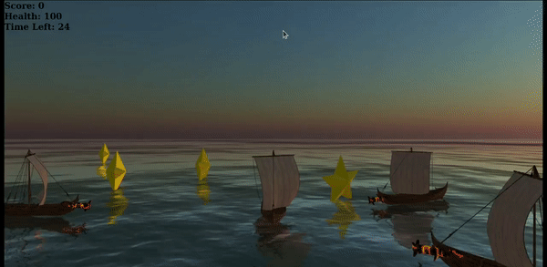

# Ship-Wars

<p align="center">
    
</p>


# Introduction

Ship Wars is a 3D game, built using WebGL and Three.js. The task assigned to you, the captain of the ship, is to collect maximum number of randomly spawning treasure chests in the given time. However, there are pirates in the ocean who are against you! Fight the pirates and try to get maximum treasure chests.

### Player Ship

You command your ship to move freely around the ocean. You may fire missiles which move in a straight line any number of times. Each missile yields a damage of 25 hitpoints to the enemy ships. Move around the ocean dodging enemy ships and missiles, while collecting maximum number of treasure chests in the limited time! Use your missiles to defend against enemy ships.

### Enemy Ships

Enemy ships spawn randomly around your ship. They fire missiles which follow your ship. Each missile yields a damage of 5 hitpoints, and each enemy ship crashing into your ship yields a damage of 25 hitpoints.

### Treasure Chests

Treasure chests are randomly spawned within a square area of 250x250 units around the player ship. They can be collected by the player ship to increase the score of the player. They are represented by stars.

## Controls


<kbd>↑</kbd> : Move up<br>
<kbd>←</kbd> : Move left<br>
<kbd>↓</kbd> : Move down<br>
<kbd>→</kbd> : Move right<br>

<kbd>space</kbd> : Fire missile<br>

## Setup

1. Clone the repository.

2. Change the working directory to the repository.
```bash
cd Ship-Wars
```

3. Run the following command to install `http-server`:
```bash
npm i http-server
```

4. Run the following command to start the server:
```bash
http-server
```

5. Open the browser and navigate to `http://localhost:8080/`. You should now be able to play the game.


